# AI & MCP Implementation Plan — Fi-Plan Engine

> Branch: `mcp-implementeation` · Status: **Design complete, implementation pending**
>
> Goal: give the Fi-Plan engine a **unified AI capability layer** with three access surfaces — over the *same*
> tool registry, *same* engine, and *same* data the web app uses:
>
> 1. **In-app AI assistant** — users chat with an AI agent right inside the app (session-cookie auth)
> 2. **MCP over HTTP** — external agents (Claude Code/Desktop, any MCP client) connect to `/api/mcp` (API-token auth)
> 3. **MCP over stdio** — local agents spawn the server as a subprocess (env-token auth)
>
> Agents can issue commands, inspect & update financial plans, run what-if simulations, and answer questions.

---

## 1. Vision & Goals

| # | Goal | Success criterion |
|---|------|-------------------|
| G1 | Agents can read plans | Agent can list plans, fetch a plan with cashflows/accounts/loans/FDP |
| G2 | Agents can update plans | Agent can add/update/delete income, expense, cashflow changes, loans, FDP — with the exact validation the web app applies |
| G3 | Agents can simulate | Agent can run the real `ComputePlanSnapshot` engine over a plan *with hypothetical patches* ("what if salary doubles in month 24?") without touching the DB |
| G4 | Agents answer questions | "What is my runway?", "When do I hit ₹1Cr net worth?" — answered by combining tools |
| G5 | Zero core regressions | Engine / application / domain / infrastructure code stays **unchanged**; everything is purely additive |
| G6 | Secure by default | Token-based auth for external MCP, session auth in-app, per-user isolation, no cross-user data access |
| G7 | AI inside the app | A chat assistant surface where users can ask questions and give commands ("add a 10% salary hike from month 12", "what's my runway?") — same tools as external agents |
| G8 | One tool layer, three surfaces | The tool registry (schemas + handlers) is written **once**; in-app assistant and MCP transports consume the same registry — no drift |

---

## 2. What Already Exists (Recap)

The repo is a Next.js 15 app with a **fully embedded backend** (`src/server/`) — a faithful clean-architecture
port of findependence-core. Key layers:

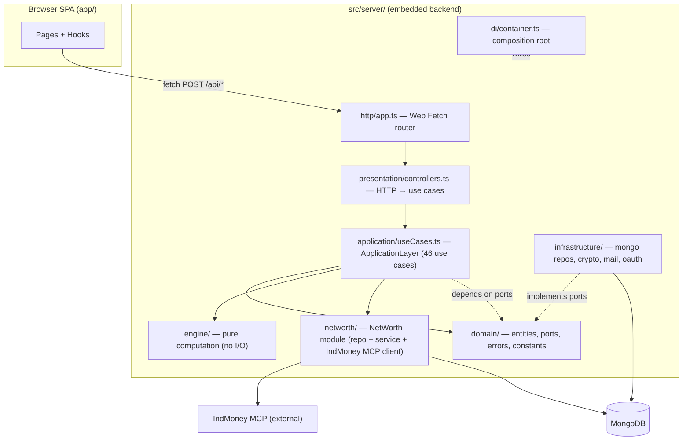

Critical facts that shape this design:

1. **`engine/` is pure** — `ComputePlanSnapshot(plan, duration)`, `GenerateTransactionsAndAccountBalances`, loan math, etc. take plain JSON objects and return plain JSON. No DB, no network. This is what makes MCP *simulation* trivial.
2. **`ApplicationLayer` already has 46 use cases** (see §8) that take `{ user_id, ... }` and enforce ownership. The tool layer is just another *presenter* — like `controllers.ts` but speaking JSON-RPC (MCP) or tool-calls (in-app agent loop) instead of HTTP.
3. **The `networth/` module is the template** for this work: a self-contained folder with its own `types/service/repository/provider`, wired into `container.ts`. The new `mcp/` module will mirror this pattern.
4. **`@modelcontextprotocol/sdk@1.30.0` is already a dependency** — with `McpServer`, `StdioServerTransport`, `StreamableHTTPServerTransport` (incl. stateless mode), and `InMemoryTransport` (for tests).
5. **`app/api/[[...path]]/route.ts`** builds the container once and forwards every HTTP method to the backend — the MCP HTTP endpoint can reuse the exact same `getApp()`/container pattern.

### 2.1 SDK Surface — Verified (installed `@modelcontextprotocol/sdk@1.30.0` + official spec 2025-03-26)

Verified against the installed `.d.ts` files and the live spec at `modelcontextprotocol.io/specification/2025-03-26/basic/transports`:

| Claim | Evidence |
|---|---|
| `McpServer` + `server.connect(transport)` | `dist/esm/server/mcp.d.ts` |
| `registerTool(name, { title, description, inputSchema, outputSchema }, cb)` — zod raw shapes accepted (`ZodRawShapeCompat`) | `mcp.d.ts:150` |
| `ToolCallback(args, extra)` receives `extra: RequestHandlerExtra` containing **`authInfo?: AuthInfo`** | `shared/protocol.d.ts:173-185` |
| `AuthInfo = { token, clientId, scopes, expiresAt?, resource?, extra?: Record<string, unknown> }` — `extra` is our carrier for `{ user_id }` | `server/auth/types.d.ts` |
| **`WebStandardStreamableHTTPServerTransport`** — Web `Request`/`Response` transport, runs on any runtime (works in Next.js route handlers) | `server/webStandardStreamableHttp.d.ts` |
| Stateless mode: `sessionIdGenerator: undefined` → no session validation, no `Mcp-Session-Id` | same file, options docs |
| `enableJsonResponse: true` → server returns plain JSON per POST instead of SSE streams — exactly what a stateless Next.js endpoint needs | same file |
| `handleRequest(req, { authInfo })` — auth info from middleware is passed through to message/tool handlers | `HandleRequestOptions` |
| `InMemoryTransport.createLinkedPair()` + `send(msg, { authInfo })` — "useful for testing authentication scenarios" | `inMemory.d.ts` |
| Streamable HTTP spec: stateless is valid (session ID optional); client MUST support single JSON response per POST; servers MUST validate `Origin` (DNS rebinding) | spec §Streamable HTTP |
| stdio transport: newline-delimited JSON-RPC; logs to stderr only | spec §stdio |

---

## 3. Design Principles (Non-Negotiable)

1. **Additive only.** No signature changes to engine, application, domain, or infrastructure. The tool layer sits *beside* the presentation layer.
2. **One engine, one source of truth.** Tools call `ApplicationLayer` use cases — never repositories directly — so validation, ownership checks, and audit behavior are identical to the web app.
3. **Thin adapters.** Each tool is a ~5-line handler: `zod`-validate input → call use case → JSON envelope out.
4. **JSON envelopes everywhere.** Every tool returns `{ ok, data?, error? }` as a JSON string so agents parse deterministically (no natural-language free-form returns).
5. **Stateless transport first** (single POST per message), **stdio for local** — same server factory, two MCP transports.
6. **Simulation never persists.** What-if runs operate on a deep-copied plan JSON through the pure engine.
7. **One tool registry, three surfaces.** Tool schemas + handlers are defined once (`makeToolRegistry`); the in-app agent loop and the MCP server both consume it — the surfaces can never drift apart.

---

## 4. Target Architecture & Layer Interaction

The capability layer is a **second presenter** beside `controllers.ts`. Nothing in the core changes — the
container gains new members (`mcp_server`, `ai_provider`, tool registry), exactly as it gained
`networth_service` for the net worth module. Three surfaces, one shared tool registry:

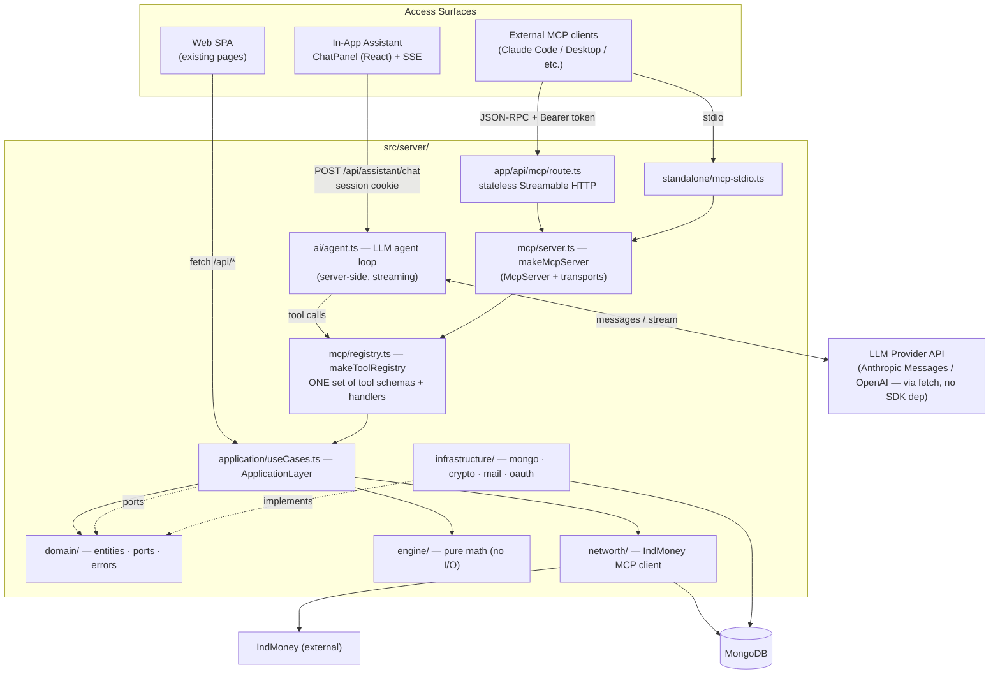

**Interaction contract:**

| Layer | Who calls it | How |
|---|---|---|
| `engine/` | application, registry tools (simulation only) | pure function calls on plain JSON |
| `application/useCases.ts` | controllers (HTTP), registry tools | `app.SomeUseCase({ user_id, ... })` |
| `domain/ports.ts` | application only | dependency injection at container build |
| `infrastructure/` | nobody directly (except container) | implements ports; wired in `di/container.ts` |
| `mcp/registry.ts` | in-app agent loop, `makeMcpServer` | `makeToolRegistry(container)` → named tool defs |
| `mcp/server.ts` | MCP transports (stdio / HTTP route) | `makeMcpServer(container)` returns an `McpServer` |
| `ai/agent.ts` | `app/api/assistant/chat` route | session `user_id` → registry handlers → LLM loop |

**Key asymmetry:** the in-app assistant calls registry handlers **directly** (no JSON-RPC hop — it is
server-side code), while external agents reach the same handlers through the MCP protocol. Auth context
(`user_id`) is the only thing that differs: session cookie in-app, API token for MCP.

---

## 5. Auth: API Tokens (Bearer)

MCP sessions come from *agents*, not browsers — cookies don't apply. Options considered:

| Option | Verdict |
|---|---|
| OAuth 2.1 (like IndMoney's MCP) | Overkill for v1; SDK has `OAuthServerProvider` for later |
| Reuse session cookie | Agents can't hold browser cookies reliably |
| **Bearer API tokens** | ✅ Minimal, additive, matches existing crypto infra (`GenerateHash`) |

**Design:**

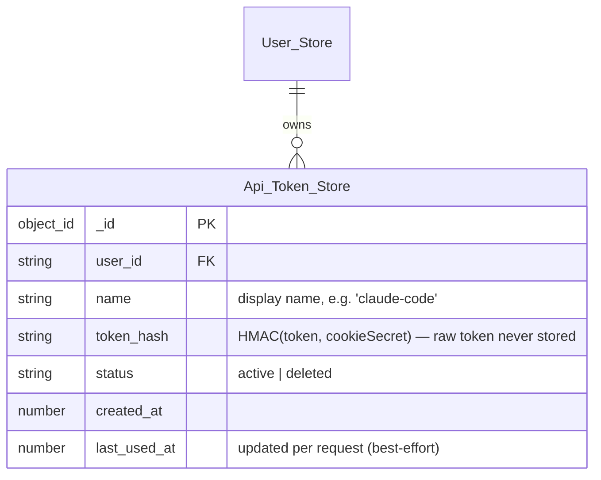

- **Token format**: `fp_` + 32 random chars (`GenerateRandomString`), shown **once** at creation.
- **Storage**: hashed with the existing `GenerateHash(token, COOKIE_SECRET)` — same crypto as passwords/sessions. Raw token un-recoverable.
- **Auth header**: `Authorization: Bearer fp_<token>` on the HTTP transport; `FIPLAN_API_TOKEN` env var for the stdio transport (single-user local mode).
- **In-app surface needs no token**: the assistant chat route authenticates via the user's existing session cookie (`CheckSession`) and synthesizes the same tool context from it. API tokens exist purely for *external* agents.
- **Resolution → tool context**: the route resolves the token to `user_id` *before* handing the request to the transport, and passes it through the SDK's first-class auth channel: `transport.handleRequest(req, { authInfo: { token, clientId, scopes: ["fiplan"], extra: { user_id } } })`. Every tool handler then reads `extra.authInfo.extra.user_id` — no globals, no thread-locals, and `user_id` is **never** a tool argument. On stdio, the same `AuthInfo` is synthesized from `FIPLAN_API_TOKEN` at startup.
- **Management (web)**: profile page section + `POST /api_token/create|list|revoke` endpoints + use cases `CreateApiToken / ListApiTokens / RevokeApiToken`.

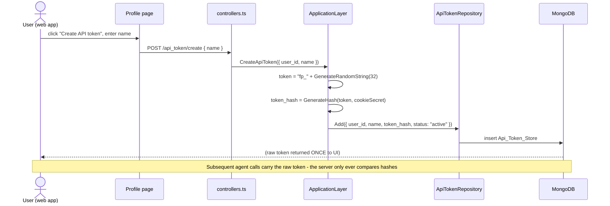

---

## 6. Runtime & Transports

Two transports, one `McpServer`:

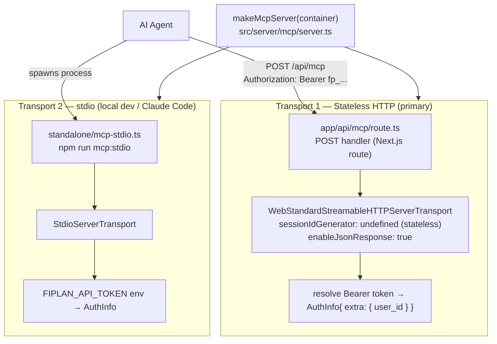

- **HTTP (stateless)**: each MCP message is a single POST answered with a single JSON response — no SSE sessions, no session state, no `Mcp-Session-Id`. The spec explicitly supports this mode (session ID is optional), and `enableJsonResponse: true` is the SDK switch for it. Built on `WebStandardStreamableHTTPServerTransport`, which consumes Web `Request`/`Response` — a native fit for Next.js route handlers. Shares `getApp()`/container pattern with `app/api/[[...path]]/route.ts`. GET requests (spec-mandated endpoint) are answered by the transport itself (SSE stream or 405), so the route only needs to expose `GET` + `POST`.
- **stdio (local)**: for `claude code -p` / Claude Desktop via `mcp add`, runs the container in a child process. Needs `DB_URL` + `FIPLAN_API_TOKEN` in env.

---

## 7. In-App AI Assistant (surface #1)

Users get a chat assistant **inside the app** — same tools as external agents, authenticated by their
existing session, with zero token setup.

### 7.1 Design

- **Server-side agent loop** (`src/server/ai/agent.ts`): the browser never talks to the LLM directly and
  never holds API keys. The loop runs in the backend, calls the registry handlers in-process, and streams
  results back over SSE.
- **LLM via plain `fetch`** — no heavy SDK dependency. Provider abstraction (`src/server/ai/provider.ts`):
  ships the **Anthropic Messages API** implementation since it has first-class tool-use; the endpoint is
  configurable via `AI_BASE_URL` + `AI_MODEL` env, so **DeepSeek works as-is**
  (`AI_BASE_URL=https://api.deepseek.com/anthropic`); an OpenAI-compatible implementation behind the same
  interface is a drop-in for later. Thinking blocks (DeepSeek reasoning) are captured from the stream and
  echoed back verbatim — required by DeepSeek, spec-correct for Anthropic.
- **Tool schemas for the LLM**: registry tools are defined with zod shapes; the agent loop converts them to
  JSON Schema for the LLM request using the SDK's **`toJsonSchemaCompat`** (verified in
  `dist/esm/server/zod-json-schema-compat.d.ts:8`) — one definition, two consumers.
- **Loop**: system prompt ("You are the Fi-Plan assistant… answer from tool data, never invent numbers") +
  conversation + tool schemas → if `stop_reason: tool_use`, execute via registry with `ctx = { user_id }`,
  append `tool_result` + echo thinking blocks, repeat (cap 8 iterations) → stream final answer.
- **Streaming**: `/api/assistant/chat` streams SSE events: `session` (id, first), `text`, `thinking`,
  `tool_call` (name + args), `tool_result` (ok/error), `error` (with optional `code`, e.g. `OFF_TOPIC`),
  `done`, then `[DONE]`. Assistant replies render as **GitHub-flavored markdown** (react-markdown + GFM,
  dark-themed); plain text while a message is still streaming.
- **Guardrails** (see §7.5): deterministic pre-LLM topic gate + system-prompt scope rules — no coding,
  no other domains, no standalone math.
- **Session persistence**: conversations persist to `Chat_Session_Store` (Mongo) — history feeds the model
  context on resume; see §7.4.
- **UI** (`src/components/assistant/ChatPanel.tsx`): floating panel in the app shell (cockpit aesthetic),
  **full-screen on mobile with the launcher moved into the TopNav** (desktop keeps the floating FAB),
  message bubbles, live streaming, tool-call badges, entity reference chips, session list drawer,
  markdown rendering, suggestion chips on the empty state, one-click "stop". Uses the same fetch/auth
  helpers as the rest of the app (session cookie).

### 7.2 Flow

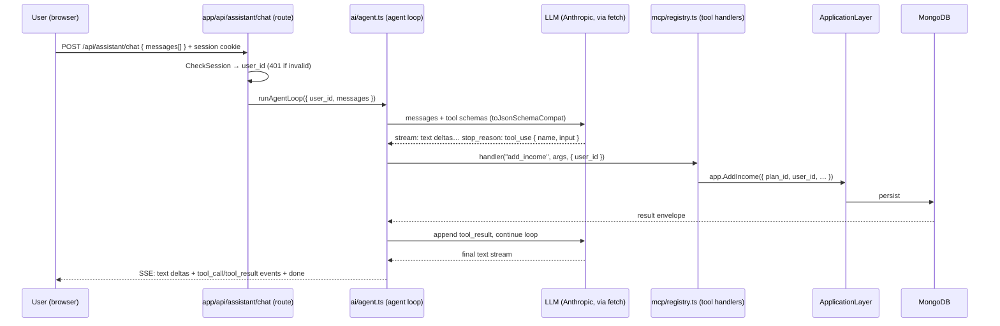

### 7.3 Why not run MCP client in the browser?

The in-app assistant *could* speak MCP over HTTP from the browser — but then the browser holds the API
token, CORS + Origin rules get involved, and every tool round-trip is a separate HTTP hop. Since the
assistant is already server-side code, calling the registry directly is simpler, faster, and keeps the
session cookie as the only credential. External agents still get full MCP (§6).

### 7.4 Chat sessions & entity references (v1.1)

**Goal:** conversations persist per user, the assistant window lists past sessions and lets the user
resume them, and every entity the agent touches surfaces as a clickable reference in the chat.

**Storage** — new `Chat_Session_Store` collection (entity `ChatSession`, port `ChatSessionRepository`):

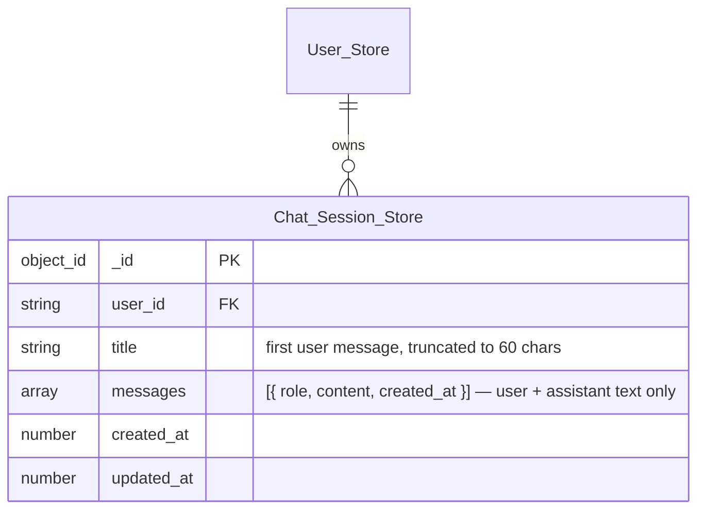

**API (session-authenticated, same envelope as the rest of the app):**

| Endpoint | Body | Returns |
|---|---|---|
| `POST /api/chat_session/create` | `{ data: { title? } }` | `{ session_id }` |
| `POST /api/chat_session/list` | `{ data: {} }` | `[{ _id, title, created_at, updated_at, message_count }]` |
| `POST /api/chat_session/get` | `{ data: { session_id } }` | `{ session, messages }` (ownership enforced) |
| `POST /api/chat_session/delete` | `{ data: { session_id } }` | `{ deleted: true }` |
| `POST /api/assistant/chat` | `{ session_id?, messages }` | now **persists**: loads stored history into the model context, appends the user message + final assistant text, emits `{ type: "session", id }` as the first SSE event, updates `title`/`updated_at` |

**Entity references** — derived **client-side** from the streamed `tool_call`/`tool_result` events (no
backend round-trip): every tool argument or result containing an entity id yields a reference chip in the
message:

| Entity | Source (tool args / result) | Target |
|---|---|---|
| Plan | `plan_id` in any tool args or `_id` in plan results | `/plan?p_id=<id>` |
| Cashflow / income / expense / cashflow change | `plan_id` present in the same call | `/plan?p_id=<id>` (entity lives inside the plan) |
| Share object | `AddShareObject`/`UpdateShareObject` result `_id`/`share_ids` | `/shared_templates` |
| Net worth | `networth_*` tool names | `/networth` |

**UI (ChatPanel)** — session list drawer (open/close button): shows `title`, relative `updated_at`,
"New session" action; clicking a session loads it (fetch + restore message bubbles + `session_id`) and
continues; delete with confirm. References render as chips (icon + label) below the message, navigable
with `router.push`.

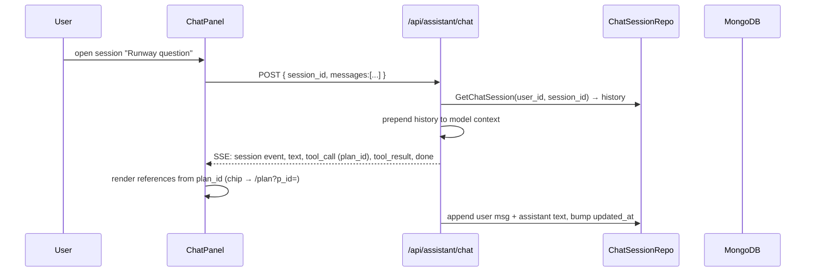

### 7.5 Guardrails

Two layers keep the assistant in scope (FiPlan topics + brief natural small talk only — no coding, no
other domains, no standalone math):

1. **Deterministic pre-LLM gate** (`src/server/ai/guardrails.ts`, `classifyTopic`) — runs before any LLM
   cost in the chat route:
   - **Blocks**: coding/software requests; other domains (cooking, sports, movies, history, geography,
     translations, poems, news…); **standalone arithmetic** (`345*12`) — but plan-adjacent math
     ("if my rent rises 10% and my salary is ₹80,000") passes because it references plan context.
   - **Allows**: plan-related questions + small talk (greetings, thanks, "what can you do").
   - Blocked requests get a friendly decline + steer-back as an `OFF_TOPIC` error SSE event — no LLM
     call, no session created, nothing persisted.
2. **System-prompt scope rules** — the final judge for borderline cases: explicit ALLOWED list (plans,
   runway, cashflows, hikes/inflation, loans, FDP, net worth, retirement, savings + brief small talk)
   and FORBIDDEN list (code, other domains, general knowledge, translations, ungrounded math), with a
   one-sentence polite decline + steer-back behavior.

Also encoded in the prompt: exact cashflow-change frequency semantics (one-time = `end_month =
start_month`; yearly = `frequency "y"`; monthly is compounding) so hike/inflation modeling is precise.

---

## 8. Tool Inventory (v1)

All tools map 1:1 onto existing `ApplicationLayer` methods (`src/server/application/useCases.ts:65`).
`user_id` is **never** a tool argument — it comes from the auth context (session cookie in-app, API token for MCP).

### 8.1 Identity & plans

| Tool | Inputs (zod) | Use case | Notes |
|---|---|---|---|
| `whoami` | — | `GetUser({ user_id })` | Lets the agent verify identity |
| `list_plans` | — | `plan_list.FindByUserId(user_id)` | All user's plans (default plan flagged) |
| `get_plan` | `plan_id` | `plan_list.FindById` | Full plan: accounts, cashflows, changes, loans, FDP |
| `create_plan` | `title, description?, monthly_income, monthly_expense, runway?` | `AddPlan` | Same defaults as onboarding |
| `update_plan` | `plan_id, changes` (validated patch) | `UpdatePlan` | |
| `delete_plan` | `plan_id` | `DeletePlan` | |
| `fork_plan` | `plan_id, title, description?` | `ForkPlan` | |
| `set_default_plan` | `plan_id` | `SetDefaultPlan` | |

### 8.2 Cashflows

| Tool | Inputs | Use case |
|---|---|---|
| `list_income` | `plan_id` | `GetIncome` |
| `add_income` | `plan_id, desc, amount, start_month, end_month?, frequency?` | `AddIncome` |
| `update_income` | `income_id, changes` | `UpdateIncome` |
| `delete_income` | `income_id` | `DeleteIncome` |
| `list_expense` | `plan_id` | `GetExpense` |
| `add_expense` | `plan_id, desc, amount, start_month, end_month?, frequency?` | `AddExpense` |
| `update_expense` | `expense_id, changes` | `UpdateExpense` |
| `delete_expense` | `expense_id` | `DeleteExpense` |

### 8.3 Cashflow changes (hikes, bonuses, inflation…)

| Tool | Inputs | Use case |
|---|---|---|
| `list_cashflow_changes` | `plan_id` | `GetCashflowChanges` |
| `add_cashflow_change` | `cashflow_id, change_desc, change_category, change_type?, value, start_month` | `AddCashflowChange` |
| `update_cashflow_change` | `change_id, changes` | `UpdateCashflowChange` |
| `delete_cashflow_change` | `change_id` | `DeleteCashflowChange` |

### 8.4 Engine & simulation (the killer feature)

| Tool | Inputs | Use case / engine fn | Persists? |
|---|---|---|---|
| `plan_snapshot` | `plan_id, duration?` | `PlanSnapshot({ plan, duration })` | ❌ read-only |
| `simulate_plan` | `plan_json, patches[], duration?` | `ComputePlanSnapshot` after `ApplyScenarioToPlan` | ❌ never |
| `loan_amortization` | `amount, interest_rate, tenure` | `ComputeLoanAmortizationSchedule` | ❌ |

**What-if simulation design** — `simulate_plan` takes an arbitrary plan JSON (agent can fetch via `get_plan`, then mutate) plus an ordered list of *scenario patches* applied to a deep copy before snapshotting:

```json
{
  "plan_json": { "...": "full plan document, as returned by get_plan" },
  "duration": 120,
  "patches": [
    { "op": "add_income",        "cashflow": { "desc": "side hustle", "amount": 30000, "start_month": 24, "end_month": 60 } },
    { "op": "add_expense",       "cashflow": { "desc": "car EMI", "amount": 15000, "start_month": 12 } },
    { "op": "add_cashflow_change","change":  { "cashflow_id": "c1", "value": 10, "start_month": 36, "change_category": "rise" } },
    { "op": "add_loan",          "loan":    { "amount": 500000, "interest_rate": 9, "tenure": 60 } },
    { "op": "add_fdp",           "fdp":     { "amount": 100000, "interest_rate": 7, "tenure": 24 } },
    { "op": "set_account_balance","account_id": "a1", "month": 12, "balance": 250000 }
  ]
}
```

`ApplyScenarioToPlan(plan, patches)` is a **new pure function** (lives in `src/server/mcp/simulate.ts`, or better
as an additive export in `engine/` if it proves generically useful) that validates each patch against domain
constants (`CASHFLOW_CONSTANTS`, `ACCOUNT_CONSTANTS`) and applies it. Output: the same `PlanSnapshot` shape
the app uses — `account_balances_and_transactions`, `income_expense_and_net_cashflow`, `runway`, etc. — so the
agent can compute **runway, net-worth milestones, corpus-at-retirement** and compare scenarios.

*Note:* SDK 1.30 `registerTool` also accepts `outputSchema` (zod) with structured `output` results — a v1.1
refinement on top of the JSON-string envelopes if agents start needing strictly typed outputs.

### 8.5 Net worth

| Tool | Inputs | Use case |
|---|---|---|
| `networth_status` | — | `GetNetWorthStatus` |
| `networth_sync` | — | `SyncNetWorth` (pulls fresh from IndMoney MCP) |
| `networth_connect_url` | `redirect_url` | `ConnectNetWorth` (for the web flow) |

### 8.6 Sharing

| Tool | Inputs | Use case |
|---|---|---|
| `list_share_objects` | — | `GetShareObjects` |
| `create_share_object` | `plan_ids[], title, description?` | `AddShareObject` |
| `update_share_object` | `share_id, changes` | `UpdateShareObject` |
| `delete_share_object` | `share_id` | `DeleteShareObject` |

### 8.7 Loan / FDP (v1.1 — engine already supports both)

Loan/FDP creation goes through `UpdatePlan` patches today; v1.1 adds dedicated tools once the web app's
loan/FDP flows are confirmed (engine has `MakeLoanObject`, `AmortizationScheduleByMonth`, `MakeLoanScheduleByMonthToCashFlow`).

---

## 9. Request Flows

### 9.1 Authenticated tool call (HTTP transport)

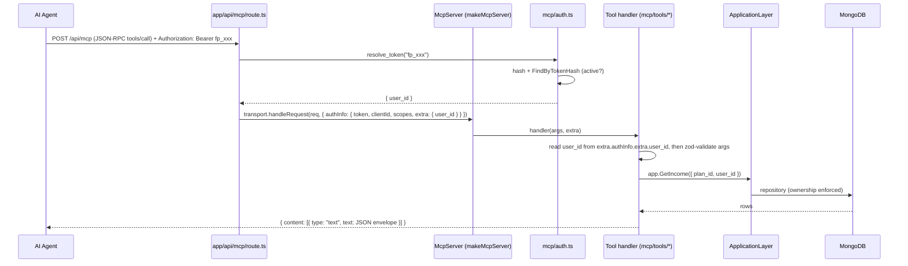

### 9.2 What-if simulation (no DB writes)

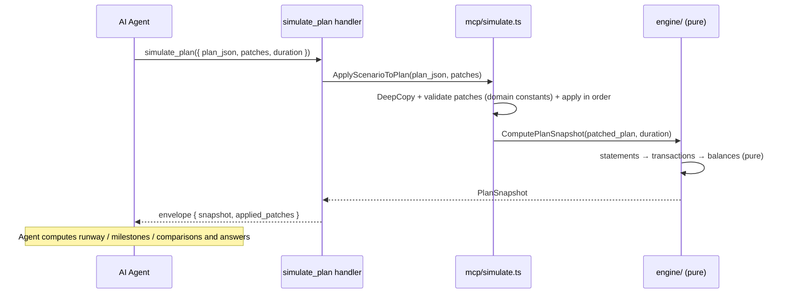

### 9.3 Error handling

All tool failures return `{ isError: true }` with a structured envelope — never a raw stack:

```json
{ "ok": false, "error": { "code": "VALIDATION_FAILED", "message": "...", "details": {} } }
```

---

## 10. Additive Changes to the Core (File-by-File)

### 10.1 New files

| Path | Purpose |
|---|---|
| `src/server/mcp/index.ts` | module barrel |
| `src/server/mcp/types.ts` | `ToolContext { user_id }`, envelope types, tool result types |
| `src/server/mcp/auth.ts` | `resolveToken(token)` → `AuthInfo{ token, clientId, scopes, extra: { user_id } }` via ApiTokenRepository (passed to `handleRequest`) |
| `src/server/mcp/simulate.ts` | `ApplyScenarioToPlan(plan, patches)` — pure, validated |
| `src/server/mcp/registry.ts` | **`makeToolRegistry(container)`** — the single source of tool schemas (zod) + handlers `(ctx, args) → envelope`; consumed by both the MCP server and the in-app agent loop |
| `src/server/mcp/server.ts` | `makeMcpServer(container)` — wraps the registry via `registerTool`, reads `user_id` from `extra.authInfo.extra.user_id`, returns `McpServer` |
| `src/server/mcp/tools/plans.ts` | plan + identity tool definitions |
| `src/server/mcp/tools/cashflows.ts` | income/expense definitions |
| `src/server/mcp/tools/changes.ts` | cashflow-change definitions |
| `src/server/mcp/tools/engine.ts` | `plan_snapshot`, `simulate_plan`, `loan_amortization` |
| `src/server/mcp/tools/networth.ts` | net-worth definitions |
| `src/server/mcp/tools/share.ts` | share-object definitions |
| `app/api/mcp/route.ts` | Next.js route mounting stateless Streamable HTTP MCP |
| `standalone/mcp-stdio.ts` | stdio entry for local agents |
| `src/server/ai/index.ts` | AI module barrel |
| `src/server/ai/types.ts` | `AiMessage`, `ToolCall`, `AiStreamEvent`, `AiProvider` interface |
| `src/server/ai/provider.ts` | `makeAnthropicProvider(env)` — Anthropic Messages API over plain `fetch`, streaming |
| `src/server/ai/agent.ts` | `runAgentLoop({ ctx, messages, registry, provider })` — tool-use loop, max iterations, SSE event emission |
| `src/server/ai/prompts.ts` | system prompt ("never invent numbers; always read via tools") |
| `app/api/assistant/chat/route.ts` | POST route: session auth → agent loop → SSE stream to the browser |
| `src/components/assistant/ChatPanel.tsx` + `messages/` | in-app chat UI (floating panel, streaming render, tool badges) |
| `tests/mcp/*.test.ts` | sociable tests (see §12) |
| `tests/ai/*.test.ts` | agent-loop + chat-route tests with a fake provider (see §12) |

### 10.2 Existing files — touched (additive edits only)

| Path | Change |
|---|---|
| `src/server/domain/entities.ts` | add `ApiToken` entity type |
| `src/server/domain/ports.ts` | add `ApiTokenRepository` port (`Add`, `FindByTokenHash`, `FindByUserId`, `Update`) |
| `src/server/infrastructure/repositories.ts` | `makeApiTokenRepository(db)` → `Api_Token_Store` collection |
| `src/server/application/useCases.ts` | `CreateApiToken`, `ListApiTokens`, `RevokeApiToken` (+ `FindPlanById` if `get_plan` can't reuse existing paths) |
| `src/server/presentation/controllers.ts` | 3 routes: `/api_token/create|list|revoke` |
| `src/server/di/container.ts` | `api_token_list`, `mcp_server`, `ai_provider`, `tool_registry` members |
| `src/server/config/env.ts` | `MCP_ENABLED` flag, `AI_PROVIDER` (default `anthropic`), `ANTHROPIC_API_KEY` |
| `app/(app)/profile/*` | token management UI (create with one-time reveal, list, revoke) |
| `app/(app)/*` shell | mount `ChatPanel` (floating assistant toggle) |
| `package.json` | script `"mcp:stdio": "tsx standalone/mcp-stdio.ts"` |

### 10.3 Explicitly **not** touched

- `src/server/engine/**` — pure engine untouched (unless `ApplyScenarioToPlan` is donated to `engine/` as a new file, which is still additive)
- `src/server/application/useCases.ts` existing 46 use cases — no signature changes
- `src/server/infrastructure/*` — only additive new factory
- Web app pages (except profile token UI)

---

## 11. Component Diagram of the AI + MCP Module

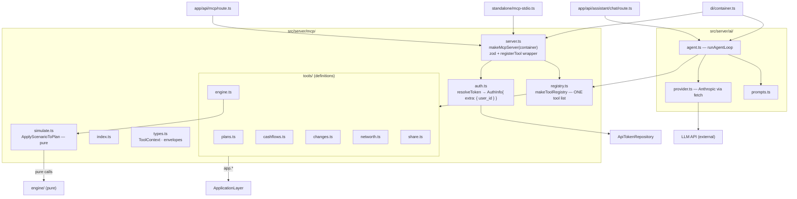

---

## 12. Testing Strategy (sociable, per repo conventions)

Use the SDK's **`InMemoryTransport`** (`createLinkedPair()`) — boot a real container against
`mongodb-memory-server` (as existing tests do), connect an in-process MCP *client*, and drive tools
end-to-end through the protocol. `InMemoryTransport.send(msg, { authInfo })` exists precisely for auth
scenarios, so tests inject `AuthInfo{ extra: { user_id } }` the same way the route will. Mock **nothing**
except the IndMoney provider (already an injected boundary).

| Test file | Covers |
|---|---|
| `tests/mcp/auth.test.ts` | valid token → `user_id`; garbage token → error; revoked token → error; cross-user isolation (user B's token cannot read user A's plan) |
| `tests/mcp/plans.test.ts` | `list_plans` / `get_plan` / `create_plan` / `update_plan` round-trip via JSON-RPC |
| `tests/mcp/cashflows.test.ts` | add/update/delete income & expense; invalid input → `VALIDATION_FAILED` envelope |
| `tests/mcp/simulate.test.ts` | baseline snapshot; `add_income` patch raises corpus; `add_loan` patch creates EMI expense; no DB row written after `simulate_plan` (assert plan unchanged) |
| `tests/mcp/networth.test.ts` | `networth_status` with fake provider |
| `tests/ai/agent.test.ts` | fake provider scripts a `tool_use` → loop executes registry handler → second LLM call gets the `tool_result` → streamed text; iteration cap enforced; tool error → structured error event |
| `tests/ai/chat-route.test.ts` | POST `/api/assistant/chat` with session cookie → SSE stream; missing/invalid session → 401; fake provider injected via container override |
| `tests/ai/registry-parity.test.ts` | assert the MCP server's tool list (schema + name) equals the registry — the anti-drift contract for G8 |

---

## 13. Security Considerations

1. Raw tokens shown once; only HMAC hashes stored (reuses `GenerateHash` + `COOKIE_SECRET`).
2. MCP tools resolve `user_id` from `extra.authInfo.extra.user_id` (injected by the route); the in-app agent loop resolves it from the session (`CheckSession`) — tools **cannot** accept `user_id` as an argument on either surface.
3. LLM API keys live server-side only (`ANTHROPIC_API_KEY` env) — never shipped to the browser.
4. `simulate_plan` never writes; `plan_snapshot` reads only the caller's own plan.
5. Token revocation: delete → `status: deleted` → all future calls 401.
6. **Origin/host validation on the MCP endpoint** — the spec *requires* it (DNS-rebinding protection). Enforced by the Next.js route middleware, not the transport (`allowedOrigins` transport options are deprecated in 1.30). The chat route needs no Origin rules (cookie session + same-origin fetch).
7. In-app assistant writes are user-initiated but agent-executed → destructive tools (`delete_plan`, `delete_income`, …) ask for explicit confirmation in the chat UI before the agent may call them.
8. v1.1+: per-token scopes (read-only vs write), per-token rate limits, token TTL.

---

## 14. Roadmap (Phases)

```mermaid
gantt
  title AI + MCP Implementation Roadmap
  dateFormat X
  axisFormat %s

  section Foundation
  Design doc (this file)          :done, p0, 0, 1
  ApiToken entity + repo + use cases + routes + tests :p1, after p0, 3
  Token UI on profile page        :p2, after p1, 2

  section Shared tool layer
  tool registry (types/simulate/tools) + InMemoryTransport harness :p3, after p1, 2
  plan + engine tools (list/get/create/update/simulate) + tests    :p4, after p3, 3
  cashflow + change tools + tests :p5, after p4, 2

  section MCP transports
  app/api/mcp/route.ts (stateless HTTP) :p6, after p5, 2
  standalone/mcp-stdio.ts               :p7, after p6, 1

  section In-app assistant
  ai provider + agent loop + prompts + tests (fake provider) :p8, after p4, 3
  app/api/assistant/chat route (SSE)                         :p9, after p8, 2
  ChatPanel UI (floating panel, streaming, tool badges)      :p10, after p9, 3

  section Polish
  networth + share tools + tests   :p11, after p7, 2
  loan/FDP dedicated tools (v1.1)  :p12, after p11, 2
  Agent usage guide (claude code / desktop mcp add) :p13, after p11, 1
```

**Phase order rationale**: tokens first (auth gates the MCP surfaces), then the shared registry (everything
else depends on it), then MCP transports, then the in-app assistant (starts as soon as the registry's plan +
engine tools exist — the LLM loop can land in parallel with MCP transports), then the long tail.

---

## 15. Risks & Open Decisions

| Risk / decision | Mitigation / default |
|---|---|
| Next.js route handler + `WebStandardStreamableHTTPServerTransport` integration (body streaming, GET handling) | API verified in SDK 1.30 (Web Request/Response native, stateless + JSON mode); keep the spike in Phase p6 to pin the exact route shape |
| `simulate_plan` accepts arbitrary plan JSON → engine robustness | Engine already validates via `RequiredParam`; wrap in try/catch → structured error envelope |
| Where should `ApplyScenarioToPlan` live? | Default `src/server/mcp/simulate.ts`; promote to `engine/` if other layers need it |
| Token expiry? | None in v1 (revocation only); TTL in v1.1 |
| Should MCP tools be gated by `MCP_ENABLED` env? | Yes — default on in dev, explicit in prod |
| **Which LLM provider?** | Default **Anthropic Messages API** (`ANTHROPIC_API_KEY`) — first-class tool-use + streaming; provider interface keeps OpenAI/Gemini a drop-in later |
| **LLM latency/cost for the in-app assistant** | Streaming from first byte; cap tool iterations (~8); truncate plan JSON in tool results (agents get summaries + ids, fetch details on demand); v1.1: cached snapshots |
| **Agent hallucination of financial numbers** | System prompt forbids inventing data; every number must come from a tool; tool results carry the authoritative snapshot |
| **Destructive commands via chat** | Confirmation UX in ChatPanel for delete-family tools (see §13.7) |
| **SSE streaming inside Next.js route handlers** | Verified pattern: `ReadableStream` + `transformStream` in route handlers; spike in Phase p9 to pin it |

---

## 16. Out of Scope (v1)

- OAuth 2.1 MCP server (SDK `OAuthServerProvider`) — future
- MCP *resources* / *prompts* — tools only
- Multi-tenancy / orgs
- Agent-to-agent sharing of tokens
- Persistent chat history beyond per-session persistence (memory / RAG over docs) — v2
- Custom model fine-tuning; non-Anthropic providers (interface ready, impl later)
- Any change to how the web app works (assistant UI is additive)
